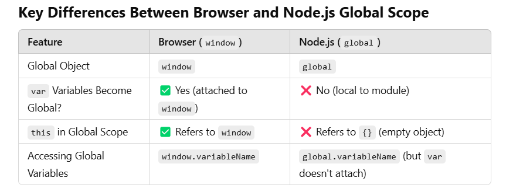

/*
Yes, the global scope in Node.js and the browser (Google Chrome) are different 
because they run in different environments.
*/

## 1. Global Scope in the Browser (Google Chrome)
In the browser, the global scope is the window object.

var a = 10;
console.log(window.a); // ✅ Output: 10
console.log(this.a);   // ✅ Output: 10 (because `this` in global scope refers to `window`)
Explanation:

In the browser, variables declared with var in the global scope become properties of window.
window is the global object in Google Chrome.

## 2. Global Scope in Node.js
In Node.js, the global object is global, not window.

var b = 20;
console.log(global.b); // ❌ Output: undefined
console.log(this.b);   // ❌ Output: undefined

Explanation:

In Node.js, variables declared with var do NOT become properties of global.
The global scope in a Node.js module is not the global object but rather the module itself.
Unlike the browser, this in the global scope of Node.js refers to an empty object {}, not global.

## 3. Example: Running the Same Code in Browser and Node.js

var x = 100;
console.log(this.x);
console.log(global.x);
console.log(window.x);

Output in Browser (Google Chrome)
100
Uncaught ReferenceError: global is not defined
100

Output in Node.js
undefined
undefined
Uncaught ReferenceError: window is not defined

Conclusion
✅ The browser uses window as the global object, while Node.js uses global.
✅ Variables declared with var in the browser attach to window, but in Node.js, they do not attach to global.
✅ this behaves differently in global scope for both environments.

### In Node.js:

Each file is a separate module.
Variables declared with var, let, or const inside a module do not become global.
They are only accessible within that module (file).
In Node.js, var a = 10; is scoped to the module (not global).
this in the module refers to an empty object {}, meaning the module itself.