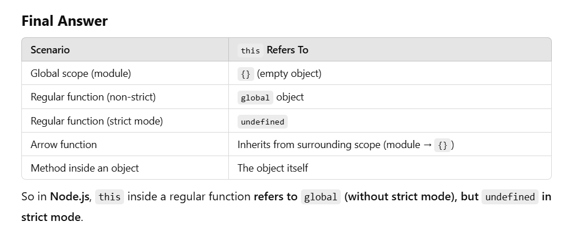

1. if the function is part of an object i.e method, then this will be referring to the object only.

2. Yes, if you create a function named Video (with an uppercase first letter, by convention) and use it with the new keyword, it will be treated as a constructor function in JavaScript.

Example:
function Video(title) { 
    this.title = title; 
    console.log("Constructor function called!");
}

const myVideo = new Video("JavaScript Tutorial"); 
console.log(myVideo);
How it works:
1️⃣ The function Video is used as a constructor function when called with new.
2️⃣ this inside Video refers to the new object being created.
3️⃣ The title property is assigned to the new object.
4️⃣ The console.log(myVideo) will output:

Video { title: 'JavaScript Tutorial' }
What if called without new?
Video("JavaScript Basics"); // ❌ Here, `this` refers to the global object (or `undefined` in strict mode)
In this case, title would be assigned to the global object instead of a new instance.

What about an object named video?
If you already have an object like this:
const video = { name: "Sample Video" };
And then you define:

function Video() { }
Then Video is still just a normal function. It only becomes a constructor function when used with new.

3. 
function Video(title) { 
    this.title = title;   
    console.log("Constructor function called!");
}

Video("JavaScript Tutorial"); // this is not a constructor 
console.log(window.title);   // output -> JavaScript Tutorial

/* if run on browser, since new keyword is not there so this in the function
will refer to the global object which is window. here in window object 
the property named as title will get added into it*/

4. 
3️⃣ Inside a Function (With "use strict")

"use strict";
function test() {
    console.log(this);
}
test();
🔹 Output:
✅ Prints: undefined
Why?

In strict mode, this is not automatically bound to global.
Instead, it remains undefined.

5. this related to Arrow functions :
const test = () => {
    console.log(this);
};
test();
🔹 Output:
✅ Prints: {} (Empty object)
Why?

Arrow functions do not have their own this.
Instead, they inherit this from the surrounding scope, which in a Node.js module is {}.

 --> final compilation of this 

6. 
function Video(title) { 
    this.title = title; // now this points to current object
    console.log("Constructor function called!");
}

const myObj = new Video("JavaScript Tutorial"); // this is a constructor  
// since we created an object through the constructor , in objects , this 
point to the object only .

7. +++++++++++ important ++++++++++

(A)
const video = {
    title : 'a',
    tags : ['a', 'b', 'c'],
    showTags(){
        this.tags.forEach(function(tag){
            console.log(this,tag);
        });
    }
};

video.showTags();

(B)
const video = {
    title : 'a',
    tags : ['a', 'b', 'c'],
    showTags(){
        this.tags.forEach((tag)=>{
            console.log(this,tag); // ye vala this is referring to global object 
            //and window object in case of browsers , so we can't use this.tile
        });
    }
};

video.showTags();

8. important 

callback function when passed like this can take another parameter too, The second parameter of forEach is the thisArg, which allows you to explicitly set the value of this inside the callback function.

and this is passed which refers to the current object and since showTags() function has still its execution context , so it is fine as we are not inside the callback function yet. 
we can send the object to which this inside the callback should point to.

